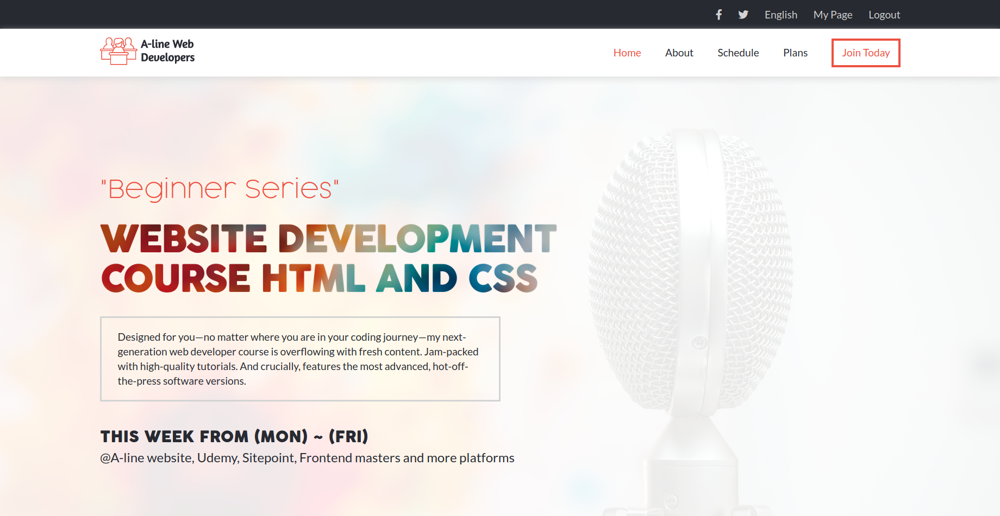

# Html Capstone Project

## Project Description
This project required that we turn the following design as specified [here](https://www.behance.net/gallery/29845175/CC-Global-Summit-2015) into HTML and CSS using our custom content. We were required to use flexbox and a framework of your choice or grid framework. 
I mainly used flexbox to create this project in its responsive nature. I defined my own classes to make all the pages appear well on the differnt screen viewports.

## How it was Implemented

I considered creating the desktop view first then continued to make it responsive with smaller and bigger screen sizes using define classes from scratch.

Please checkout the live version of the implemented project [here]()

## Built With

* HTML5
* CSS
* VSCode
* Google fonts (Lato)

## Authors

👤 **Nakitto Catherine** 
* Github: [@githubhandle](https://github.com/Cathella)
* Twitter: [@twitterhandle](https://twitter.com/cathella9)
* Linkedin: [linkedin](https://www.linkedin.com/in/catherine-nakitto-51ba2a40/)

## 🤝 Contributing

Contributions, issues and feature requests are welcome!
Feel free to check the [issues page](issues/).

## 🤝 Credits

Special thanks to The [Creative Commons license of the design](https://creativecommons.org/licenses/by-nc/4.0/) and [Cindy Shin](https://www.behance.net/adagio07) in Behance for the beautiful design.

Contributions, issues and feature requests are welcome!
Feel free to check the [issues page](issues/).
